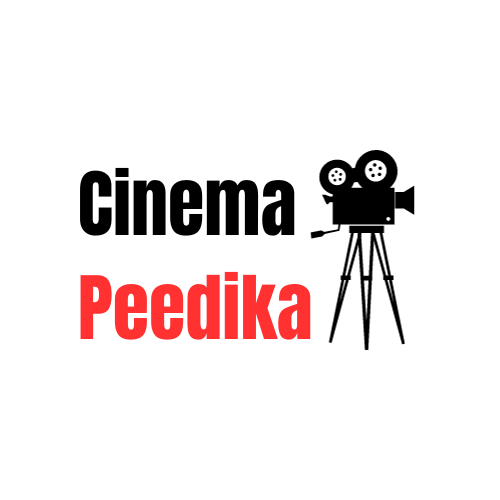

# Cinema Peedika - Hub for Cinephiles

Cinema Peedika is a comprehensive online platform dedicated to cinephiles and movie enthusiasts. This project merges the functionality of an information-rich movie database similar to IMDb with the convenience of a movie ticket booking platform like BookMyShow. With Cinema Peedika, we aim to simplify the movie-going experience, making it more enjoyable and hassle-free.

## Project Description

Cinema Peedika is a web-based platform designed to cater to the needs of cinephiles and movie enthusiasts. It seamlessly combines the features of an information-rich movie database, providing details about movies, actors, directors, and genres, with a convenient movie ticket booking platform for an enhanced movie-watching experience.

## Key Features

Cinema Peedika offers the following key features:

1. User registration and authentication.
2. Comprehensive movie search functionality.
3. Display of trending movies.
4. Genre-wise movie categorization for easy browsing.
5. A secure and user-friendly movie ticket booking system.
6. A user contact form for inquiries and feedback.
7. A well-structured and responsive website design.

## Technologies Used

The core technology stack used in this project includes:

- HTML
- CSS
- JavaScript
- (Add any additional technologies or frameworks used)

---

Cinema Peedika is the ultimate hub for cinephiles. With a rich movie database and a convenient ticket booking system, we aim to make your movie-watching experience exceptional. Enjoy exploring, discovering, and booking your favorite movies with ease.

For any inquiries or feedback, please [contact us](link-to-contact-page).

Happy watching! 🍿🎥🎬
